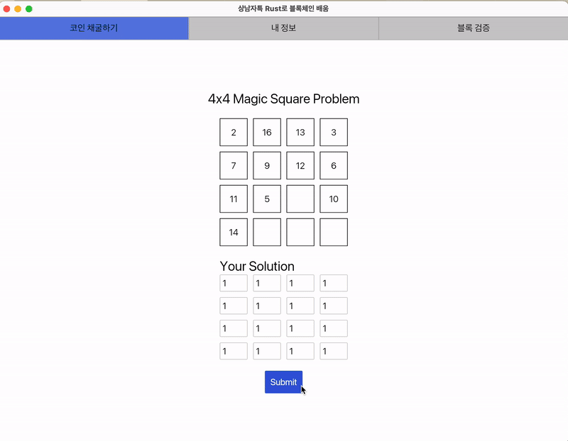
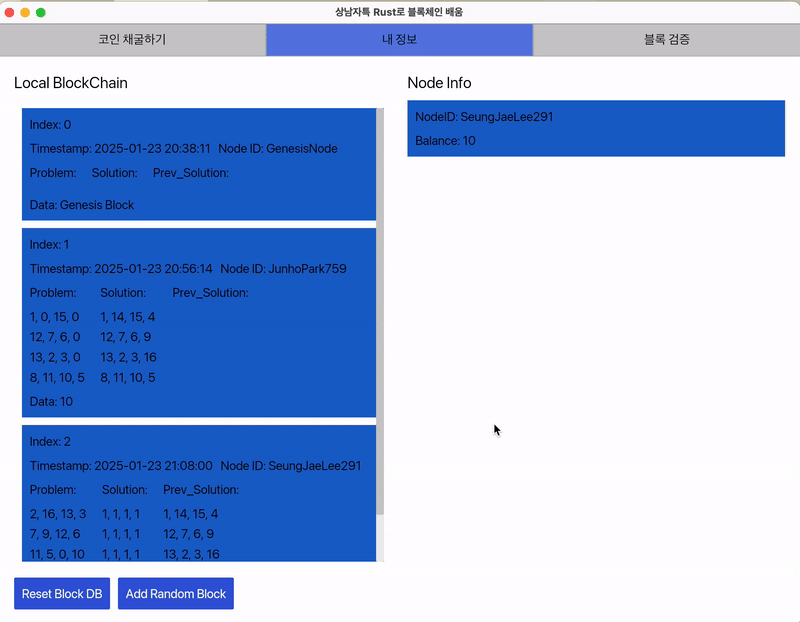

# 일주일내 Rust로 블록체인 구현 도전기

<!--배지-->
![Repository Size][repository-size-shield]

<!--프로젝트 대문 이미지-->


# [1] About the Project

- **몰입캠프 4주차 프로젝트**
- 일주일안에 처음 사용해보는 언어로 블록체인이라는 원리를 쉽고 재미있게 배우는 학습 exe실행파일을 만들어 배포해보기.

## Features
- 기존의 블록체인은 hash기능과, 정답의 범위를 조절하여 문제 및 블록의 구성을 만들어냈다면, 우리의 학습 플랫폼에서는 마방진이라는 게임을 이용하여 초보자에게도 개념을 친숙하게 다가가서 적용 가능하다.

## BlockChain - Server Flow
1. 서버가 문제를 브로드캐스트
    * 서버는 새로운 문제를 생성하고 이를 모든 노드에 브로드캐스트한다.
2. 노드가 문제 풀이 후 블록을 생성하여 서버로 제출
    * 각 노드는 서버로부터 받은 문제를 풀고, 풀이 결과를 기반으로 블록을 생성하여 서버에 제출한다.
3. 서버는 블록을 다른 노드에 전달하여 검증 요청
    * 서버는 제출된 블록을 다른 모든 노드로 브로드캐스트하여 검증 요청을 보낸다.
4. 노드는 블록 검증 후 서버로 결과 반환
    * 각 노드는 블록을 검증한 결과를 서버로 반환한다.
    * 검증 결과는 블록의 유효성 여부를 포함
5. 서버는 결과를 수집하고 블록 승인 여부를 결정
    * 서버는 노드들로부터 반환된 검증 결과를 수집한다.
    * **현재는 무조건 승인으로 되어있다.**
6. 서버가 승인된 블록을 전체 노드에 브로드캐스트
    * 승인된 블록은 서버에서 모든 노드로 브로드캐스트된다.
    * 이를 통해 모든 노드가 동일한 승인된 블록을 공유한다.

## Technologies

- [Rust](https://www.rust-lang.org/) 1.84.0
- [iced](https://iced.rs/) 0.12.1 (Rust GUI library)
- [rocksdb](https://rocksdb.org/) 0.19


# [2] Getting Started


## Prerequisites
Rust가 설치되어 있지 않다면 아래 명령어로 설치하세요.

```sh
curl --proto '=https' --tlsv1.2 -sSf https://sh.rustup.rs | sh
```

## Installation

1. Repository 클론
```bash
git clone https://https://github.com/Ea3124/MapCamp4thWeek
cd blockchain-learning-platform
```

2. Server 실행
```bash
cd server
cargo run
```

3. Client 실행
```bash
cd client
cargo run
```

## Configuration

- nothing for configuration


# [3] Usage with flow




### 1️⃣ 문제 생성 및 브로드캐스트

- 서버는 새로운 문제(4x4 마방진)를 생성하고 네트워크에 브로드캐스트한다.
- `broadcast_problem()` 함수 (`my_broadcast.rs`):
  - `generate_incomplete_magic_square(4)`를 호출하여 일부 값이 비워진 마방진 문제를 생성
  - `Problem` 객체를 `problem_tx` 채널을 통해 모든 클라이언트에게 전송

---

### 2️⃣ 클라이언트의 블록 제출

- 클라이언트는 문제를 해결한 후 `POST /submit_block` 엔드포인트를 통해 블록을 제출한다.
- `handle_block_submission()` 함수 (`my_broadcast.rs`):
  - `current_block`이 `None`일 경우에만 블록을 받아들임
  - 블록이 존재하면 `"Block already submitted"` 응답을 반환
  - 새로운 블록이 제출되면 네트워크에 브로드캐스트

---

### 3️⃣ 검증 결과 제출

- 블록이 제출되면 네트워크 내의 노드들이 검증을 수행한다.
- 클라이언트는 `POST /submit_validation` 엔드포인트를 호출하여 검증 결과를 제출한다.
- `handle_validation_results()` 함수 (`main.rs`):
  - 검증 결과를 `process_consensus()` 함수에 넘겨 합의를 수행
  - **과반수(majority) 합의 방식**을 사용하여 블록이 유효한지 판단

---



### 4️⃣ 합의 및 새로운 문제 생성

- `process_consensus()` 함수 (`my_broadcast.rs`)에서 합의를 수행한다.
- 현재는 최소 **1개 이상의 검증이 성공하면** 합의가 완료된 것으로 간주된다.
- 합의가 완료되면 새로운 문제를 생성하고 이를 브로드캐스트한다.

---

## 📌 라우트 정리

| HTTP 메소드 | 경로 | 설명 |
|------------|------|------|
| `GET` | `/broadcast_problem` | 새로운 문제를 생성하고 브로드캐스트 |
| `POST` | `/submit_block` | 블록을 제출 |
| `POST` | `/submit_validation` | 검증 결과를 제출 |
| `GET` | `/ws` | WebSocket 연결을 통해 실시간 문제 및 블록 수신 |

모든 엔드포인트는 `routes.rs`에서 정의된다.


---

## 📌 WebSocket 실시간 브로드캐스트

- `handle_websocket()` (`my_broadcast.rs`) 함수는 문제와 블록을 실시간으로 전달하는 WebSocket 기능을 제공한다.
- `problem_tx`, `block_tx`를 통해 수신된 데이터를 WebSocket을 통해 전송한다.

---

## 📌 서버 초기화 및 실행

- `main.rs`에서 서버를 실행하며, `axum`을 사용하여 HTTP 및 WebSocket 엔드포인트를 구성한다.

# [4] Team Introduce

|Server & Network|Client & GUI|
|:---:|:---:|
|  |  |
|[이승재](https://github.com/Ea3124)|[심희승](https://github.com/simmath2004)|
|leesj6717@gmail.com| - |
 
<!--Url for Badges-->
[license-shield]: https://img.shields.io/github/license/dev-ujin/readme-template?labelColor=D8D8D8&color=04B4AE
[repository-size-shield]: https://img.shields.io/github/repo-size/dev-ujin/readme-template?labelColor=D8D8D8&color=BE81F7
[issue-closed-shield]: https://img.shields.io/github/issues-closed/dev-ujin/readme-template?labelColor=D8D8D8&color=FE9A2E

<!--Url for Buttons-->
[readme-eng-shield]: https://img.shields.io/badge/-readme%20in%20english-2E2E2E?style=for-the-badge
[view-demo-shield]: https://img.shields.io/badge/-%F0%9F%98%8E%20view%20demo-F3F781?style=for-the-badge
[view-demo-url]: https://dev-ujin.github.io
[report-bug-shield]: https://img.shields.io/badge/-%F0%9F%90%9E%20report%20bug-F5A9A9?style=for-the-badge
[report-bug-url]: https://github.com/dev-ujin/readme-template/issues
[request-feature-shield]: https://img.shields.io/badge/-%E2%9C%A8%20request%20feature-A9D0F5?style=for-the-badge
[request-feature-url]: https://github.com/dev-ujin/readme-template/issues

<!--URLS-->
[license-url]: LICENSE.md
[contribution-url]: CONTRIBUTION.md
[readme-eng-url]: ../README.md


